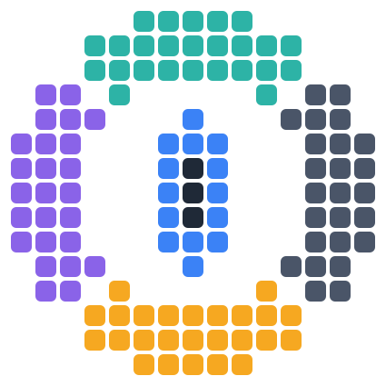

<p align="center">
	<a href="https://github.com/ToolAssisted-run/chimera/actions/workflows/ci.yml"></a>
	<a href="https://github.com/ToolAssisted-run/chimera/releases/tag/dev"></a>
	<a href="https://github.com/ToolAssisted-run/chimera/releases"></a>
</p>

<p align="center">
	<picture>
		<source media="(prefers-color-scheme: dark)" srcset="docs/icon-dark.svg">
		
	</picture>
	&nbsp;&nbsp;
	<picture>
		<source media="(prefers-color-scheme: dark)" srcset="docs/logotype-dark.svg">
		
	</picture>
</p>

Chimera is a minimal frontend for creating tool-assisted speedruns (TAS).

## Supported systems

The officially maintained cores currently offered for Chimera are:

| System | Core |
| --- | --- |
| Nintendo Entertainment System | [quickerNES](https://github.com/ToolAssisted-run/chimera-core-quickernes) |
| Nintendo Entertainment System | [QuickerNesHawk](https://github.com/ToolAssisted-run/chimera-core-neshawk) |
| Super Nintendo | [Snes9x](https://github.com/ToolAssisted-run/chimera-core-snes9x) |
| Mega Drive / Genesis | [Genesis Plus GX](https://github.com/ToolAssisted-run/chimera-core-gpgx) |
| Sega CD / Mega CD | [Genesis Plus GX](https://github.com/ToolAssisted-run/chimera-core-gpgx) |
| Master System | [Genesis Plus GX](https://github.com/ToolAssisted-run/chimera-core-gpgx) |
| Game Gear | [Genesis Plus GX](https://github.com/ToolAssisted-run/chimera-core-gpgx) |
| SG-1000 | [Genesis Plus GX](https://github.com/ToolAssisted-run/chimera-core-gpgx) |
| Dreamcast | Flycast \* |
| PlayStation 2 | PCSX2 \* |
| PlayStation Portable | [PPSSPP](https://github.com/ToolAssisted-run/chimera-core-ppsspp) |
| 3DO Interactive Multiplayer | [Opera](https://github.com/ToolAssisted-run/chimera-core-opera) |
| Atari 2600 | [Stella](https://github.com/ToolAssisted-run/chimera-core-stella) |
| MS-DOS | [DOSBox-X](https://github.com/ToolAssisted-run/chimera-core-dosbox-x) |
| Windows 3.1 / 95 / 98 | [DOSBox-X](https://github.com/ToolAssisted-run/chimera-core-dosbox-x) |

\* Not published yet, and not in the builds below.

## Getting a build

Chimera and its officially maintained cores are built together, for Linux and
Windows, and published here:

- [**Latest development build**](https://github.com/ToolAssisted-run/chimera/releases/tag/dev) - rebuilt on every change to `main` that passes the gates, and replaced each time. Nothing is published that did not pass them.
- [**Nightly builds**](https://github.com/ToolAssisted-run/chimera/releases) - dated, immutable, and kept forever. Cite one of these in a bug report or beside a movie: a run is only reproducible while the build that recorded it still exists.

Every distinct core package is kept forever too, in the
[`cores`](https://github.com/ToolAssisted-run/chimera/releases/tag/cores)
release, named by its own SHA1 - which is what a movie cites, since what a
replay has to match is the core rather than the frontend around it.

Every bundle carries `BUILD.txt`, naming the exact commit of the frontend and of
every core in it, and `LICENSES.md`, stating the terms of the whole thing.
**Those terms are non-commercial**, because some of the cores' licences are.

## Goals

These are the reasons Chimera exists as its own project rather than a BizHawk configuration:

- **Modularity.** The frontend contains no emulation core and no system-specific knowledge. Cores are external, self-contained packages (`.chimeraCore`), each maintained in its own repository under its own license, loaded explicitly like a ROM.

- **Performance.** All functional machinery (the sandbox host, movies, savestates, file formats, the running machine itself) lives in `libchimera`, a native C++ engine the GUI calls into.

- **Stronger reproducibility guarantees.** A movie's reproduction contract is the pair *(movie, core package)*: nothing about a Chimera build (compiler, libraries, OS) is allowed to affect whether a movie syncs. Movies record the exact core version, package hash, firmware hashes, and host provenance.

Chimera is not designed for casual play. For that, use the original emulators directly, or a multi-emulation frontend such as RetroArch.

## Building

The canonical build is Linux-hosted and meson-mediated, and produces the artifacts for both operating systems: the managed frontend is built once (platform-neutral IL, .NET Framework on Windows / Mono on Linux), and every native library is built twice: gcc for Linux, mingw-w64 cross for Windows. Clone with `--recursive`; the repository contains no precompiled binaries.

```
meson setup build/meson-linux   --prefix "$(pwd)/build" --libdir dll
meson setup build/meson-windows --prefix "$(pwd)/build" --libdir dll --cross-file extern/tools/meson/mingw-w64.ini
meson compile -C build/meson-linux && meson install -C build/meson-linux
meson compile -C build/meson-windows && meson install -C build/meson-windows
meson compile -C build/meson-linux frontend   # the managed solution (dotnet)
```

Linux requirements: meson, ninja, cmake, gcc, mingw-w64, and Microsoft's own .NET SDK binary (`curl -sSL https://dot.net/v1/dotnet-install.sh | bash -s -- --channel 8.0`); distro-built SDKs omit the WindowsDesktop targets the net48/WinForms frontend needs.

The frontend ships no cores, so build at least one before running it. Each lives
in `extern/cores/` and installs itself into `build/Cores/`:

```
extern/cores/quickernes/waterbox/build-package.sh   # one core
tools/build-bundle.sh --platform linux --out <dir>  # or the whole distributable
```

To run: `build\Chimera.exe` on Windows, `build/ChimeraMono.sh` on Linux, then
`File > New Project...` and pick a core. To play a rom with no project, pass
`--core=<package> <rom>` on the command line.

The witness gate runs with `tests/synth/run-witness.sh`. The engineering log (objectives, procedure, and the sharp edges found along the way) is in [docs/design-principles.md](docs/design-principles.md); the engine migration is chronicled in [docs/engine-migration.md](docs/engine-migration.md).

## Contributing

Pull requests are welcome, from people and from people working with AI assistants alike. A contribution is judged on its merits: it should build, pass the witness gate, and keep to the project's scope. The one firm requirement is legal cleanliness: you must have the right to submit the code under this repository's MIT license, and anything derived from other works must respect their licenses and carry the attribution they require.

## Credits and license

**Chimera is a derivative fork of [BizHawk](https://github.com/TASEmulators/BizHawk).** The frontend, the TAS tooling, and the architecture it builds on are the original work of the BizHawk team, and all credit for them belongs to BizHawk's developers.

Chimera is provided under the MIT License, preserving the BizHawk team's copyright; see [LICENSE](LICENSE), which also covers the native libraries built from `extern/`, the vendored test suite, and why core packages carry their own licenses. The people behind Chimera itself are in [CREDITS.md](CREDITS.md).
