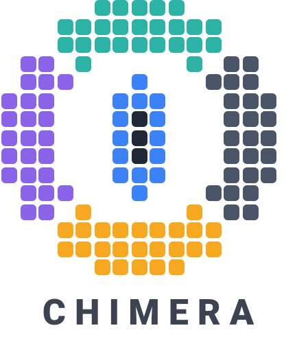

<p align="center">
	<picture>
		<source media="(prefers-color-scheme: dark)" srcset="docs/logo-dark.svg">
		
	</picture>
</p>

**Chimera is a derivative fork of [BizHawk](https://github.com/TASEmulators/BizHawk).** The frontend, the TAS tooling, and the architecture it builds on are the original work of the BizHawk team, and all credit for them belongs to BizHawk's developers.

Chimera is a minimal frontend for creating tool-assisted speedruns (TAS). It keeps BizHawk's TAS toolchain — movies, savestates, TAStudio, RAM tools, Lua — and removes everything else, most importantly every emulation core.

## Goals

These are the reasons Chimera exists as its own project rather than a BizHawk configuration:

- **Modularity.** The frontend contains no emulation core and no system-specific knowledge. Cores are external, self-contained packages (`core.wbx` + `waterbox.config` in a zip), each maintained in its own repository under its own license, loaded explicitly like a ROM. Everything a console needs — extensions, controllers, firmware declarations, settings, tooling — is declared by its package.

- **Lightweight.** One audio driver (OpenAL), one display driver (OpenGL), one adapter for every core, and nothing else: no game databases, no per-system menus, no fallback chains. What the frontend cannot justify keeping is deleted, not disabled.

- **Performance.** All functional machinery — the sandbox host, movies, savestates, file formats, the running machine itself — lives in `libchimera`, a native C++ engine the GUI calls into. The engine also runs headless (`chimera-run`) and links into bots and solvers directly, with no GUI process to puppeteer.

- **Stronger reproducibility guarantees.** A movie's reproduction contract is the pair *(movie, core package)*: nothing about a Chimera build — compiler, libraries, OS — is allowed to affect whether a movie syncs. Movies record the exact core version, package hash, firmware hashes, and host provenance. Every change to this repository must pass the witness gate: a regression suite replayed through the native engine *and* the full frontend, byte-comparing emulator memory against goldens, including per-frame savestate round-trips and greenzone seeks.

## Building

The canonical build is Linux-hosted and meson-mediated, and produces the artifacts for both operating systems: the managed frontend is built once (platform-neutral IL, .NET Framework on Windows / Mono on Linux), and every native library is built twice — gcc for Linux, mingw-w64 cross for Windows. Clone with `--recursive`; the repository contains no precompiled binaries.

```
meson setup build/meson-linux   --prefix "$(pwd)/build" --libdir dll
meson setup build/meson-windows --prefix "$(pwd)/build" --libdir dll --cross-file extern/meson/mingw-w64.ini
meson compile -C build/meson-linux && meson install -C build/meson-linux
meson compile -C build/meson-windows && meson install -C build/meson-windows
meson compile -C build/meson-linux frontend   # the managed solution (dotnet)
```

Linux requirements: meson, ninja, cmake, gcc, mingw-w64, Rust via [rustup](https://rustup.rs), and Microsoft's own .NET SDK binary (`curl -sSL https://dot.net/v1/dotnet-install.sh | bash -s -- --channel 8.0`) — distro-built SDKs omit the WindowsDesktop targets the net48/WinForms frontend needs.

To run: `build\EmuHawk.exe` on Windows, `build/EmuHawkMono.sh` on Linux. Build a core package first (for quickerNES, run its `chimera/build-package.sh` from a sibling checkout; it installs `quickernes.zip` into `build/Cores/`), then `File > Open Core...` (or `--core=<path>`) followed by the ROM.

The witness gate runs with `tests/synth/run-witness.sh`. The engineering log — objectives, procedure, and the sharp edges found along the way — is in [docs/design-principles.md](docs/design-principles.md); the engine migration is chronicled in [docs/engine-migration.md](docs/engine-migration.md).

## Contributing

Pull requests are welcome — from people, from people working with AI assistants, and from AI agents alike. A contribution is judged on its merits: it should build, pass the witness gate, and keep to the project's scope. The one firm requirement is legal cleanliness — you must have the right to submit the code under this repository's MIT license, and anything derived from other works must respect their licenses and carry the attribution they require.

## Credits and license

This project stands entirely on **BizHawk**, created and maintained by the BizHawk team ([TASEmulators/BizHawk](https://github.com/TASEmulators/BizHawk)) — the frontend architecture, the TAS tools, the emulation service interfaces, and years of accumulated correctness are theirs. Chimera is a subtraction from their work, not an addition to it.

Chimera is provided under the MIT License, preserving the BizHawk team's copyright — see [LICENSE](LICENSE), which also covers the native libraries built from `extern/`, the vendored test suite, and why core packages carry their own licenses.

This repository's history begins at the point of separation from BizHawk. The full pre-separation ancestry — including the BizHawk contributors' commit history this work is built on — is preserved in [BizHawk](https://github.com/TASEmulators/BizHawk) and in the [transitional fork](https://github.com/SergioMartin86/BizHawk) this repository was extracted from.
