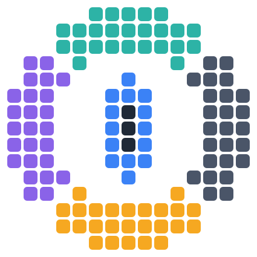

<p align="center">
	<a href="https://github.com/ToolAssisted-run/chimera/actions/workflows/ci.yml"></a>
	<a href="https://github.com/ToolAssisted-run/chimera/releases"></a>
	<a href="https://discord.gg/VsKDT9XB6u"></a>
</p>

<p align="center">
	<picture>
		<source media="(prefers-color-scheme: dark)" srcset="docs/icon-dark.svg">
		
	</picture>
	&nbsp;&nbsp;
	<picture>
		<source media="(prefers-color-scheme: dark)" srcset="docs/logotype-dark.svg">
		
	</picture>
</p>

Chimera is a minimal frontend for creating tool-assisted speedruns (TAS).

## Goals

- **Modularity.** The frontend contains no emulation core and no system-specific knowledge. Cores are external, self-contained packages (`.chimeraCore`), each maintained in its own repository under its own license, loaded explicitly like a ROM. Chimera includes none and downloads none.

- **Performance.** All functional machinery (the sandbox host, movies, savestates, file formats, the running machine itself) lives in `libchimera`, a native C++ engine the GUI calls into.

- **Stronger reproducibility guarantees.** Every core runs inside the [miniBox](https://github.com/ToolAssisted-run/chimera-common-minibox) sandbox, so the same project and input files play the same movie on any machine.

Chimera is not designed for casual play. For that, use the original emulators directly, or a multi-emulation frontend such as RetroArch.

## Cores

Chimera does not include cores and does not download them. To use a core, download its `.chimeraCore` package from the core's own project (linked below) or build it yourself, and put it in the `Cores` folder beside Chimera.

**File > Core Manager** lists the cores in that folder and lets you point Chimera at a different one ([docs/core-manager.md](docs/core-manager.md)).

### Emulation cores

| Core | Systems |
| --- | --- |
| [quickerNES](https://github.com/ToolAssisted-run/chimera-core-quickernes) | Nintendo Entertainment System / Famicom |
| [QuickerNesHawk](https://github.com/ToolAssisted-run/chimera-core-neshawk) | Nintendo Entertainment System / Famicom, Famicom Disk System |
| [ares](https://github.com/ToolAssisted-run/chimera-core-ares) | Nintendo Entertainment System / Famicom, Super Nintendo, Satellaview, Nintendo 64, Game Boy / Game Boy Color, Game Boy Advance, Mega Drive / Genesis, Mega Drive 32X, Sega CD / Mega CD, Sega CD 32X, Master System, Game Gear, SG-1000, PlayStation, Atari 2600, Atari 5200, ColecoVision, MSX / MSX2, PC Engine / TurboGrafx-16 / SuperGrafx, PC Engine CD / TurboDuo, Neo Geo AES, Neo Geo Pocket / Color, WonderSwan / WonderSwan Color |
| [Snes9x](https://github.com/ToolAssisted-run/chimera-core-snes9x) | Super Nintendo |
| [Dolphin](https://github.com/ToolAssisted-run/chimera-core-dolphin) | GameCube, Wii |
| [Azahar](https://github.com/ToolAssisted-run/chimera-core-azahar) | Nintendo 3DS / New Nintendo 3DS |
| [Genesis Plus GX](https://github.com/ToolAssisted-run/chimera-core-gpgx) | Mega Drive / Genesis, Sega CD / Mega CD, Master System, Game Gear, SG-1000 |
| [Flycast](https://github.com/ToolAssisted-run/chimera-core-flycast) | Dreamcast, Sega NAOMI / NAOMI 2 (arcade), Sammy Atomiswave (arcade) |
| [FBNeo](https://github.com/ToolAssisted-run/chimera-core-fbneo) | Capcom CPS-1 / CPS-2 / CPS-3 (arcade), Neo Geo MVS (arcade), Neo Geo CD, Sega System 16 (arcade) |
| [DuckStation](https://github.com/ToolAssisted-run/chimera-core-duckstation) | PlayStation, Namco System 11 (arcade), Konami GQ (arcade) |
| [PCSX2](https://github.com/ToolAssisted-run/chimera-core-pcsx2) | PlayStation 2 |
| [PPSSPP](https://github.com/ToolAssisted-run/chimera-core-ppsspp) | PlayStation Portable |
| [Vita3K](https://github.com/ToolAssisted-run/chimera-core-vita3k) | PlayStation Vita |
| [RPCS3](https://github.com/ToolAssisted-run/chimera-core-rpcs3) | PlayStation 3 |
| [xemu](https://github.com/ToolAssisted-run/chimera-core-xemu) | Xbox |
| [Opera](https://github.com/ToolAssisted-run/chimera-core-opera) | 3DO Interactive Multiplayer |
| [Stella](https://github.com/ToolAssisted-run/chimera-core-stella) | Atari 2600 |
| [AppleWin](https://github.com/ToolAssisted-run/chimera-core-applewin) | Apple II / II Plus / IIe (and the Pravets, TK3000 and Base64A clones) |
| [MAME X68000](https://github.com/ToolAssisted-run/chimera-core-x68k) | Sharp X68000 |
| [DOSBox-X](https://github.com/ToolAssisted-run/chimera-core-dosbox-x) | MS-DOS, Windows 3.1 / 95 / 98 |
| [PCem](https://github.com/ToolAssisted-run/chimera-core-pcem) | MS-DOS, Windows 3.1 / 95 / 98, Windows XP, Linux (x86) |
| [Ruffle](https://github.com/ToolAssisted-run/chimera-core-ruffle) | Flash |
| [EKA2L1](https://github.com/ToolAssisted-run/chimera-core-eka2l1) | Symbian / Nokia N-Gage |
| [touchHLE](https://github.com/ToolAssisted-run/chimera-core-touchhle) | iPhone OS 2.x-4.0 (iPhone, iPod touch and iPad apps) |

### Game cores

One game each, run from the game's own files ([docs/game-cores.md](docs/game-cores.md)).

| Core | Games |
| --- | --- |
| [SDLPoP](https://github.com/ToolAssisted-run/chimera-core-sdlpop) | Prince of Persia (DOS) |
| [SDLPoP2](https://github.com/ToolAssisted-run/chimera-core-sdlpop2) | Prince of Persia 2: The Shadow and the Flame (DOS) |
| [OpenSamurai](https://github.com/ToolAssisted-run/chimera-core-opensamurai) | Sword of the Samurai (DOS) |
| [SyndicatFX](https://github.com/ToolAssisted-run/chimera-core-syndicatfx) | Syndicate (DOS) |
| [rawgl](https://github.com/ToolAssisted-run/chimera-core-rawgl) | Another World |
| [DSDA-Doom](https://github.com/ToolAssisted-run/chimera-core-dsda) | Doom, Doom II, Final Doom, Heretic, Hexen, Chex Quest, Freedoom |
| [SRB2](https://github.com/P-AS/chimera-core-srb2) | Sonic Robo Blast 2 |

SRB2 is published by its author, P-AS, from their own repository.

## Getting a build

The frontend is built for Linux and Windows and published here:

- [**Latest development build**](https://github.com/ToolAssisted-run/chimera/releases/tag/dev) - rebuilt on every change to `main` that passes the gates, and replaced each time. Nothing is published that did not pass them. **Not for submissions:** a dev build is replaced on every change, so it may stop being downloadable and a movie made on it can stop being replayable. Do not use one to produce a TAS for submission to toolAssisted.run - use a nightly.
- [**Nightly builds**](https://github.com/ToolAssisted-run/chimera/releases) - dated, immutable, and kept forever. Cite one of these in a bug report or beside a movie: a run is only reproducible while the build that recorded it still exists, and this is what a TAS submitted to toolAssisted.run should be made on.

A bundle carries no cores, and Chimera never reaches the network - it downloads
nothing, not a core and not a list of them. To set one up:

1. Download a build above and unpack it.
2. Download the `.chimeraCore` package of each core you want from that core's
   releases page (the [Cores](#cores) tables link them), or build it.
3. Put the packages in the `Cores` folder beside `Chimera.exe`, and start Chimera.

Each core publishes a `dev` build and nightly releases the same way, and its
nightlies are never deleted - which is what lets a movie name the exact package
that recorded it and still be replayable years later.

Every bundle carries `BUILD.txt`, naming the exact commit it was built from, and
`LICENSES.md`, stating its terms. **Adding a core adds that core's terms**,
and some of them (Genesis Plus GX, Opera, Snes9x) forbid commercial use, which
binds whatever they are installed into; Chimera shows a core's licence once it
is in the folder.

Core packages published before the split are kept in the
[`cores`](https://github.com/ToolAssisted-run/chimera/releases/tag/cores)
release, named by SHA1. It no longer grows - each core archives its own now -
but movies recorded then still cite packages in it.

## Building

The canonical build is Linux-hosted and meson-mediated, and produces the artifacts for both operating systems: the managed frontend is built once (platform-neutral IL, .NET Framework on Windows / Mono on Linux), and every native library is built twice: gcc for Linux, mingw-w64 cross for Windows. Clone with `--recursive`; the repository contains no precompiled binaries, and
no cores - `tools/fetch-cores.sh` puts the published ones in `build/Cores` if
you want a working set without opening the frontend.

```
meson setup build/meson-linux   --prefix "$(pwd)/build" --libdir dll
meson setup build/meson-windows --prefix "$(pwd)/build" --libdir dll --cross-file extern/meson/mingw-w64.ini
meson compile -C build/meson-linux && meson install -C build/meson-linux
meson compile -C build/meson-windows && meson install -C build/meson-windows
meson compile -C build/meson-linux frontend   # the managed solution (dotnet)
```

Linux requirements: meson, ninja, cmake, gcc, mingw-w64, and Microsoft's own .NET SDK binary (`curl -sSL https://dot.net/v1/dotnet-install.sh | bash -s -- --channel 8.0`); distro-built SDKs omit the WindowsDesktop targets the net48/WinForms frontend needs.

The frontend ships no cores, so get at least one before running it - either the
published packages, or a core repository cloned wherever you like:

```
tools/fetch-cores.sh                                # every published core -> build/Cores
<core checkout>/waterbox/build-package.sh -r $PWD   # or build one yourself
tools/build-bundle.sh --platform linux --out <dir>  # the distributable (no cores)
```

To run: `build\Chimera.exe` on Windows, `build/ChimeraMono.sh` on Linux, then
`File > New Project...` and pick a core. To play a rom with no project, pass
`--core=<package> <rom>` on the command line.

The witness gate runs with `tests/synth/run-witness.sh`. The engineering log (objectives, procedure, and the sharp edges found along the way) is in [docs/design-principles.md](docs/design-principles.md); the engine migration is chronicled in [docs/engine-migration.md](docs/engine-migration.md). Building a new core, and joining it to this bundle, is [docs/porting-a-core.md](docs/porting-a-core.md).

## Reporting a problem

Open an issue on this repository, whichever core it concerns - one inbox,
and the issue template asks for what a fix needs. What settles most
reports before anybody opens a debugger:

- **Help > Report an Issue** shows the link to the report form and fills in
  its first lines for you: build, core, system, files and changed settings.
- **The build strings.** Help > Copy Version Info puts the frontend's build
  and the running core's version on the clipboard, in the template's words.
  A frontend and a core from different days may not
  understand each other's states, so before reporting a save/load problem,
  match them.
- **The project file.** A `.chimeraProject` is small and names every file
  by hash, so attach it rather than describing it.
- **The three crash files.** When Chimera or a core dies it writes a crash
  note and a minidump, `<date> pid<N>.txt` and `.dmp`, into the `Crashes`
  folder of the data directory (Config > Data Directory... opens it;
  `%LOCALAPPDATA%\Chimera` by default on Windows), and the sandbox writes
  `minibox-diag.log` next to `Chimera.exe`. Attach all three: the note
  carries the faulting instruction and the machine's last words, and two of
  three crashes in one recent report were fixed off those files alone.
- **The core's log.** Tools > Export Core Log... keeps everything the core
  says in a file you choose; it is off until asked for, and reboots the core
  so the log starts at boot. Use it again to turn it off, and attach the file.

## Contributing

Pull requests are welcome, from people and from people working with AI assistants alike. A contribution is judged on its merits: it should build, pass the witness gate, and keep to the project's scope. The one firm requirement is legal cleanliness: you must have the right to submit the code under this repository's MIT license, and anything derived from other works must respect their licenses and carry the attribution they require.

## Credits and license

**Chimera is a derivative fork of [BizHawk](https://github.com/TASEmulators/BizHawk).** most of the frontend, TAS tooling, and the architecture it builds on are the original work of the BizHawk team, and all credit for them belongs to BizHawk's developers.

Chimera is provided under the MIT License, preserving the BizHawk team's copyright; see [LICENSE](LICENSE) for the terms and [NOTICE](NOTICE) for whose work it is and what the terms do not cover: the native libraries built from `extern/`, the vendored test suite, and why core packages carry their own licenses. The people behind Chimera itself are in [CREDITS.md](CREDITS.md).
